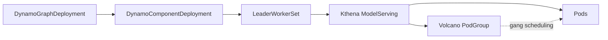

# NVIDIA Dynamo on Kthena

This guide describes how to run [NVIDIA Dynamo](https://github.com/ai-dynamo/dynamo) multinode workloads with Kthena. Dynamo creates standard `LeaderWorkerSet` (LWS) resources, and Kthena reconciles them into `ModelServing` workloads.

The integration follows this control-plane path:



Kthena preserves the LWS behavior observed by Dynamo's distributed runtimes:

| Contract | Behavior |
| -------- | -------- |
| Runtime  | Injects the standard `LWS_*` environment variables |
| DNS      | Provides LWS-compatible hostnames and shared-subdomain DNS |
| Status   | Projects replica counts and LWS conditions |
| Service  | Recreates the LWS headless Service after deletion |

## Prerequisites

- A Kubernetes cluster supported by Dynamo and Kthena.
- [Volcano](https://volcano.sh/en/docs/installation/) installed and available for gang scheduling.
- The [LeaderWorkerSet CRD](https://github.com/kubernetes-sigs/lws) installed before starting the Kthena Controller Manager (validated with LWS CRD `v0.10.0`).
- Kthena installed with the workload controller and webhook enabled. See the [Kthena installation guide](../getting-started/installation.md).
- Dynamo installed according to its [installation documentation](https://github.com/ai-dynamo/dynamo/blob/main/docs/fern/pages/kubernetes/installation/install-dynamo.md).

:::warning
Install only the LWS CRD. Do not run the native LWS controller or webhook in the same cluster because Kthena owns reconciliation of these LWS resources.
:::

## Configure Dynamo to use LWS

Use any multinode workload supported by your Dynamo release. Set `multinode.nodeCount` on the worker component and disable Grove so Dynamo selects its LWS pathway:

```yaml
apiVersion: nvidia.com/v1beta1
kind: DynamoGraphDeployment
metadata:
  name: multinode-model
  namespace: dynamo-demo
  annotations:
    nvidia.com/enable-grove: 'false'
spec:
  components:
    - name: <multinode-component>
      type: <component-type>
      multinode:
        nodeCount: 2
      # Use the podTemplate and runtime settings from a Dynamo example
      # supported by your selected release.
```

`multinode.nodeCount` marks the component as multinode. With the LWS and Volcano APIs available and Grove disabled, Dynamo renders the component as a `LeaderWorkerSet`. Refer to Dynamo's [multinode orchestration guide](https://github.com/ai-dynamo/dynamo/blob/main/docs/fern/pages/kubernetes/installation/multinode-orchestration.md) for the runtime-specific fields.

## Verify the integration

After applying the workload, inspect the complete resource chain:

```bash
kubectl get dynamographdeployments,dynamocomponentdeployments -n dynamo-demo
kubectl get leaderworkersets,modelservings,podgroups -n dynamo-demo
kubectl get pods -n dynamo-demo -o wide
```

A successful deployment has all of the following properties:

- The `DynamoGraphDeployment` reports `Ready=True`.
- Its `DynamoComponentDeployment` resources report `Available=True`.
- The multinode `LeaderWorkerSet` reports the expected `READY` and `UP-TO-DATE` replica counts and `Available=True`.
- The corresponding `ModelServing` reports the expected replica, available, and updated counts.
- Its Volcano `PodGroup` is `Running` and all leader and worker Pods are ready.

Inspect the LWS runtime environment in a leader and worker Pod:

```bash
kubectl exec -n dynamo-demo <leader-pod> -- env | grep '^LWS_'
kubectl exec -n dynamo-demo <worker-pod> -- env | grep '^LWS_'
```

For a two-node group, both Pods receive the same `LWS_LEADER_ADDRESS` and `LWS_GROUP_SIZE=2`; the leader receives `LWS_WORKER_INDEX=0` and the worker receives `LWS_WORKER_INDEX=1`.

Check the shared headless Service and Pod network identities:

```bash
kubectl get service -n dynamo-demo <lws-name> -o yaml
kubectl get pods -n dynamo-demo \
  -l leaderworkerset.sigs.k8s.io/name=<lws-name> \
  -o jsonpath='{range .items[*]}{.metadata.name}{"\t"}{.spec.hostname}{"."}{.spec.subdomain}{"\n"}{end}'
```

The Service has `clusterIP: None` and `publishNotReadyAddresses: true`. Leader and worker DNS identities use the shared-subdomain form:

```text
<lws-name>-0.<lws-name>.<namespace>
<lws-name>-0-1.<lws-name>.<namespace>
```

This identity supports Dynamo TRT-LLM's worker-host derivation from the leader address. Deleting the Service should cause Kthena to recreate it during reconciliation.

## Compatibility scope

- The integration implements LWS's default shared-subdomain network identity. `networkConfig.subdomainPolicy: UniquePerReplica` is not supported.
- Do not run the native LWS controller or webhook alongside Kthena.
- The Kthena workload webhook must remain enabled for Dynamo-generated LWS resources.
- This integration covers the current Dynamo LWS workload contract; it does not change Dynamo or provide a general replacement for every LWS feature.

For an overview of Kthena's LeaderWorkerSet integration, see [LeaderWorkerSet integration](../user-guide/lws-integration.md).
